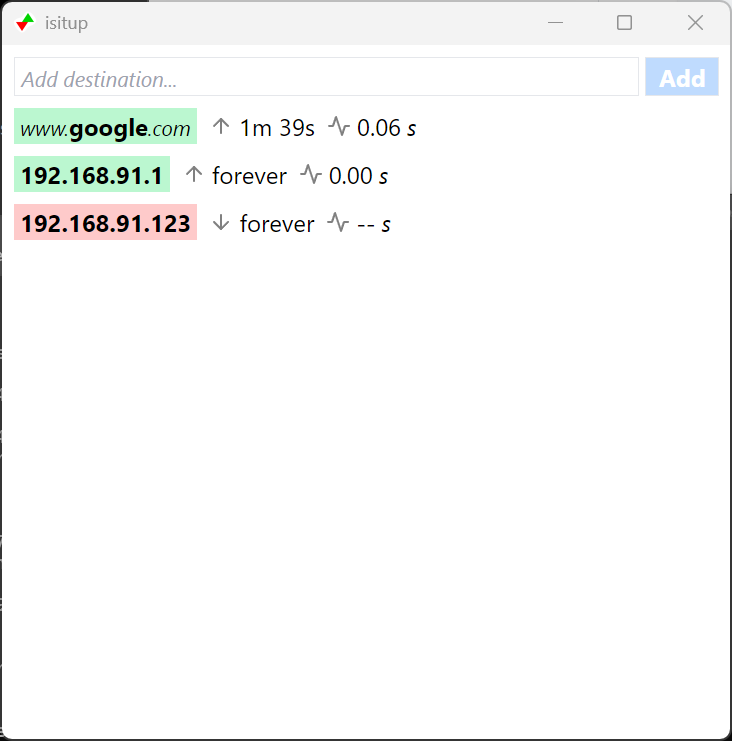

# IsItUp

IsItUp is a small tool that will continuously ping hosts and show if they
are up or down. It's useful when waiting for systems to shutdown, or become
accessible after a reboot.

## Screenshot

## Requirements

### Windows

IsItUp requires [WebView2](https://developer.microsoft.com/en-us/microsoft-edge/webview2/#download-section).
This may already be installed, especially on Windows 11.

## Installation

Download the executable from the releases page and run. There is no installation.

## Built With

- [Wails](https://wails.io/)
- [Go](https://go.dev/)
- [go-ping](https://github.com/go-ping/ping)
- [React](https://reactjs.org/)
- [Tailwind CSS](https://tailwindcss.com/)
- [Feather](https://feathericons.com/)
